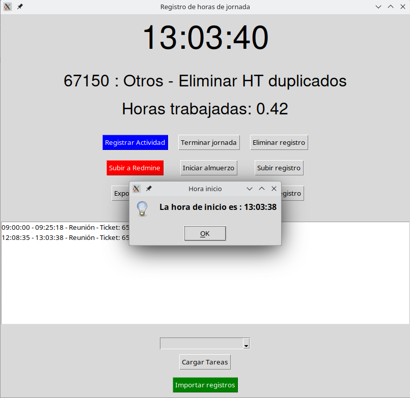

## Importar horas desde redmine

### Importación manual

Lo primero que se debe hacer es acceder a redmine con la cuenta propia e ir a 'Tiempo dedicado'. Luego filtrar por usuario para que aparezca el propio.


Entonces bajar al final y presionar en 'Exportar' a csv y hacer click en 'CSV'


Aquí preguntará las propiedades de exportación. Se debe elegir:
* Columnas seleccionadas
* UTF-8


Luego en la aplicación Counter deberás elegir la opción "Importar registros". De ahí seleccionar el archivo descargado y presionar 'Aceptar'.


*IMPORTANTE : Solo importar una sola vez los registros.*

Para verificar que los registros fueron importados debes ir a 'Bitácora' y revisar si están los registros añadidos.


## Como ocupar el counter

### Ingresar actividades

Para inicar la jornada se debe hacer click en "Registrar actividad", esto hará aparecer un cuadro de texto donde se debe seleccionar el tipo de Actividad, Los comentarios y el ticket asociado.


Al inicar la actividad esta se despegará en un texto debajo de la hora, en la cual se indica la actividad que se está realizando y su respectivo ticket. Al finalizar esa actividad se debe hacer click en 'Registrar Actividad' para actualizar el estado de trabajo. Lo anterior va a crear un registro en la caja blanca.



Ingresado este registro se puede modificar haciendo doble click en este. Haciendo esto aparecerá un cuadro de texto más pequeño que el de 'Ingresar actividad' con la hora de inicio y la hora de termino al principio. Estas horas deben ser ingresadas en el siguiente formato
* HH:MM:SS

Por ejemplo:
* 09:00:00
* 11:45:28
* 12:35:59


### Ver bitácora


## Diagrama de clases


# counter

## Generar ejecutable

Si deseas generar un ejecutable de la aplicación entonces debes ejecutar el siguiente comando:

```
pyinstaller --onefile abrir_counter.py
```
